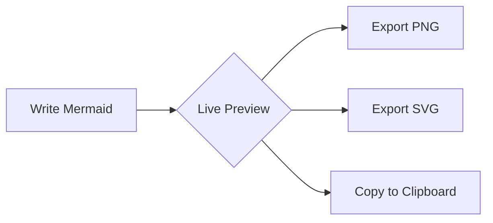

<div align="center">

# Nereid

### Mermaid Diagrams for JetBrains IDEs

*A full-featured, free, and open-source Mermaid diagramming plugin for all JetBrains IDEs.*

[](https://mermaid.js.org/)
[](https://plugins.jetbrains.com/plugin/29877-nereid)
[](LICENSE)

[Getting Started](#-getting-started) | [Features](#-features) | [Installation](#-installation) | [Contributing](#-contributing)

</div>

---

## About

**Nereid** brings the full power of [Mermaid.js](https://mermaid.js.org/) to your JetBrains IDE with live preview, syntax highlighting, code completion, and export capabilities. Create beautiful diagrams without leaving your editor.



---

## 🚀 Getting Started

1. Install from **Settings** → **Plugins** → **Marketplace** → Search "Nereid"
2. Create a new file with `.mmd` extension
3. Start typing your diagram and watch it render in real-time!

---

## ✨ Features

### Editor
| Feature | Description |
|---------|-------------|
| **Live Preview** | Real-time rendering with configurable debounce delay |
| **Split View** | Editor-only, split, or preview-only modes |
| **Syntax Highlighting** | Full highlighting for all Mermaid syntax |
| **Code Completion** | Smart completion for diagram types, keywords, arrows, and shapes |
| **Error Detection** | Instant feedback on syntax errors |
| **Code Folding** | Collapse diagram sections |
| **Brace Matching** | Automatic bracket/brace matching |
| **Commenting** | Toggle comments with `Ctrl+/` |

### Preview
| Feature | Description |
|---------|-------------|
| **Mermaid v11** | Latest Mermaid.js with all diagram types |
| **Zoom & Pan** | Mouse wheel zoom (`Ctrl+scroll`) and drag to pan |
| **Fit to View** | Automatically fit diagram to preview area |
| **Theme Selection** | Default, Dark, Forest, and Neutral themes |
| **Background Selection** | Match IDE, White, Dark, or Transparent |

### Export Options
- **PNG** — Configurable scale (1x, 2x, 3x) with transparency support
- **SVG** — Vector format with optional embedded fonts
- **Clipboard** — Copy diagram directly for quick sharing

---

## 📊 Supported Diagram Types

Nereid supports **all 20+ Mermaid diagram types**, including:

<table>
<tr>
<td>

- Flowchart / Graph
- Sequence Diagram
- Class Diagram
- State Diagram
- Entity Relationship
- Gantt Chart
- Pie Chart

</td>
<td>

- Git Graph
- Mindmap
- Timeline
- Quadrant Chart
- Requirement Diagram
- C4 Context
- Sankey Diagram

</td>
<td>

- XY Chart
- Block Diagram
- ZenUML *(v11)*
- Packet Diagram *(v11)*
- Kanban *(v11)*
- Architecture *(v11)*
- User Journey *(v11)*

</td>
</tr>
</table>

---

## 📦 Installation

### From JetBrains Marketplace (Recommended)

1. Open **Settings** → **Plugins** → **Marketplace**
2. Search for **"Nereid"**
3. Click **Install** and restart your IDE

### Manual Installation

1. Download the latest release from [GitHub Releases](https://github.com/nereid/nereid/releases)
2. Open **Settings** → **Plugins** → ⚙️ → **Install Plugin from Disk**
3. Select the downloaded ZIP file

---

## ⌨️ Keyboard Shortcuts

| Shortcut | Action |
|----------|--------|
| `Ctrl+Shift+E` | Open export dialog |
| `Ctrl+Shift+C` | Copy as PNG |
| `Ctrl+/` | Toggle comment |
| `Ctrl+Scroll` | Zoom in/out |

---

## 🔧 Building from Source

```bash
./gradlew buildPlugin
```

The plugin ZIP will be generated in `build/distributions/`.

---

## 🤝 Contributing

Contributions are welcome! Feel free to:

- 🐛 [Report bugs](https://github.com/mirkozagami/nereid/issues)
- 💡 [Suggest features](https://github.com/mirkozagami/nereid/issues)
- 🔧 [Submit pull requests](https://github.com/mirkozagami/nereid/pulls)

---

## 🙏 Acknowledgements

This plugin was built with the assistance of [Claude Code](https://claude.ai/code), Anthropic's AI coding assistant.

---

## 📄 License

This project is **dual-licensed**:

### Open Source License

Licensed under the **GNU General Public License v3.0** (GPL-3.0). You are free to use, modify, and distribute this software under the GPL terms, which requires derivative works to also be open source under the same license. See the [LICENSE](LICENSE) file for details.

### Commercial License

For use in closed-source or proprietary applications, a commercial license is available.

📧 **Contact:** [mirko.zagami@cogitocreo.com](mailto:mirko.zagami@cogitocreo.com)
