# Mermaid Diagram Samples for Marketplace Screenshots

## 1. Flowchart - Software Development Process

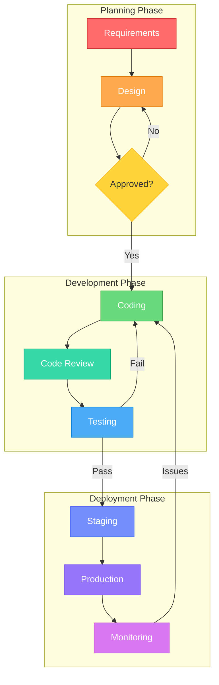

---

## 2. Sequence Diagram - Authentication Flow

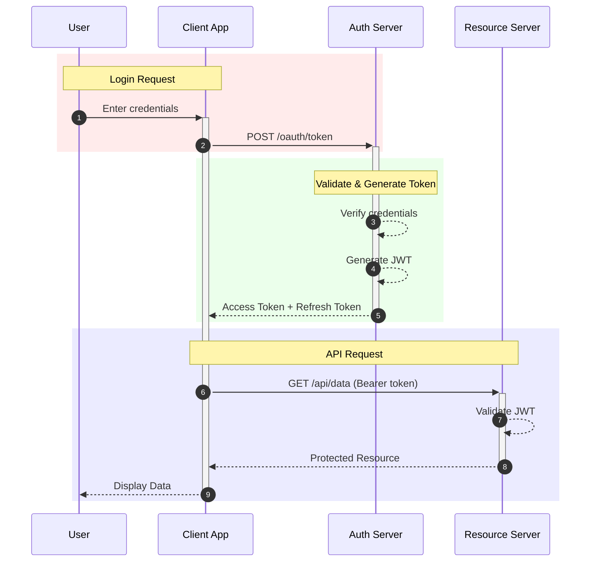

---

## 3. Class Diagram - E-Commerce System

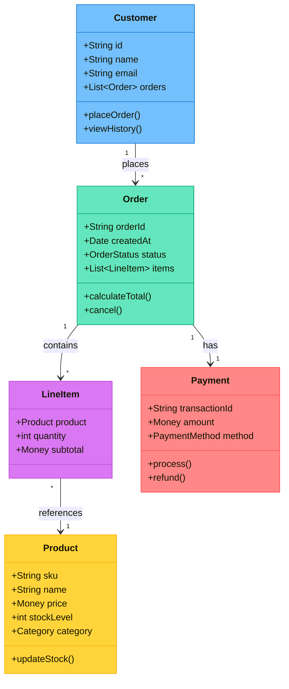

---

## 4. State Diagram - Order Lifecycle

```mermaid
stateDiagram-v2
    direction LR

    [*] --> Pending: Order Created

    Pending --> PaymentProcessing: Payment Initiated
    PaymentProcessing --> Confirmed: Payment Success
    PaymentProcessing --> Pending: Payment Failed

    Confirmed --> Preparing: Start Fulfillment
    Preparing --> Shipped: Dispatch
    Shipped --> Delivered: Arrival Confirmed

    Delivered --> [*]

    Pending --> Cancelled: User Cancels
    Confirmed --> Cancelled: Admin Cancels
    Cancelled --> [*]

    Delivered --> Refunded: Refund Requested
    Refunded --> [*]

    classDef pending fill:#ffd43b,stroke:#fab005,color:#333
    classDef processing fill:#74c0fc,stroke:#1c7ed6,color:#fff
    classDef success fill:#69db7c,stroke:#2f9e44,color:#fff
    classDef error fill:#ff8787,stroke:#fa5252,color:#fff

    class Pending pending
    class PaymentProcessing processing
    class Confirmed,Preparing,Shipped success
    class Delivered success
    class Cancelled,Refunded error
```

---

## 5. Entity Relationship Diagram - Blog Platform

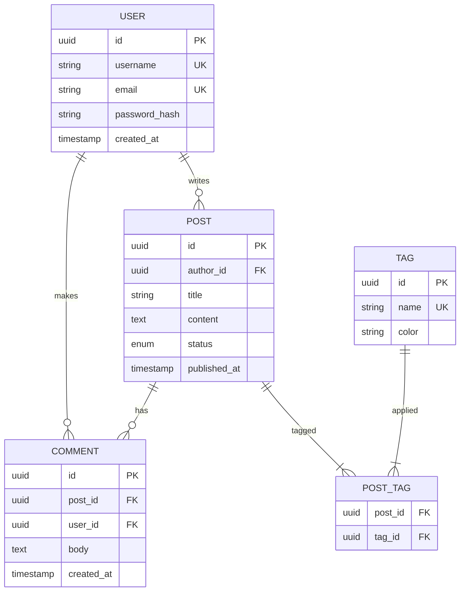

---

## 6. Pie Chart - Technology Stack Usage

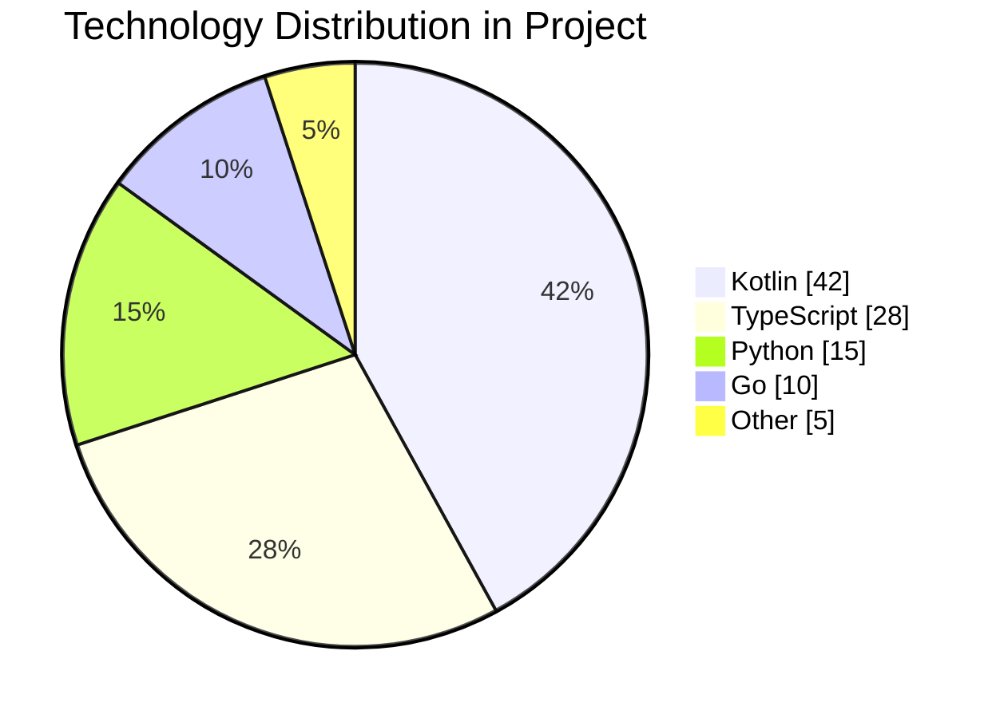

---

## 7. Gantt Chart - Sprint Planning

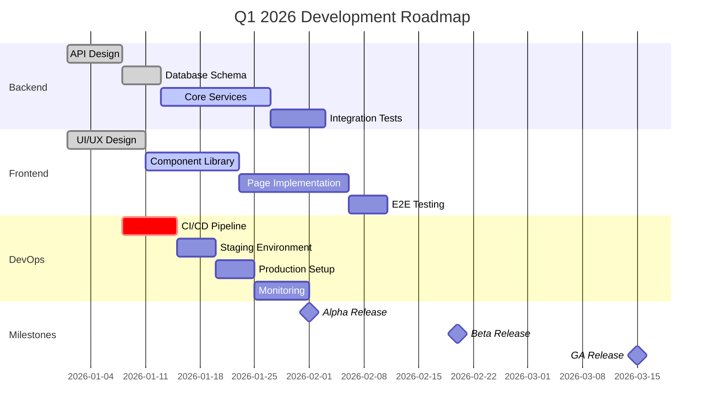

---

## 8. Mindmap - Project Architecture

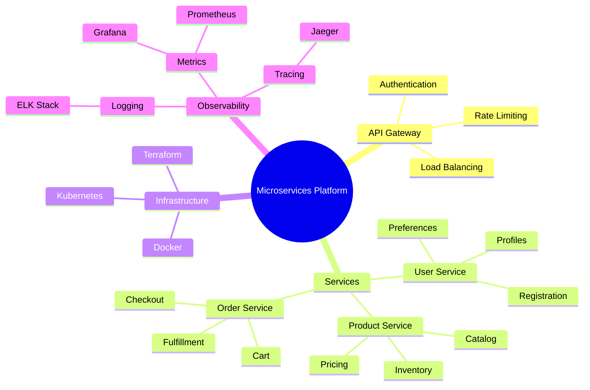

---

## 9. Git Graph - Feature Branch Workflow

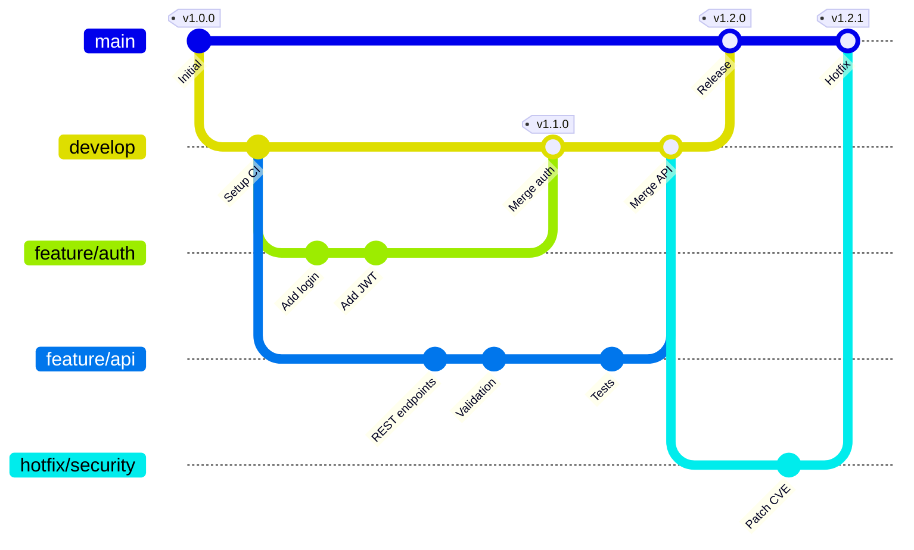

---

## 10. Timeline - Product Evolution

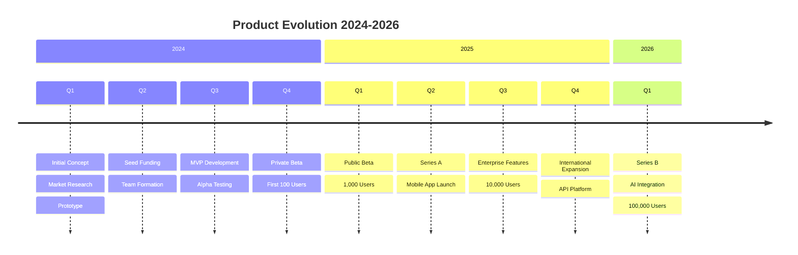

---

## 11. Quadrant Chart - Technology Evaluation

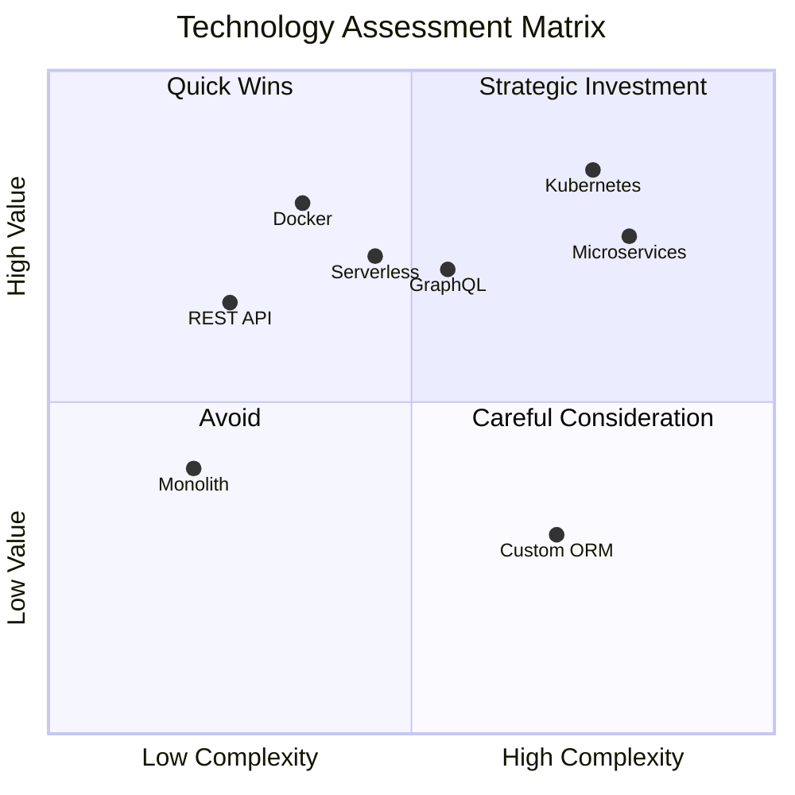

---

## 12. Requirement Diagram - User Stories

```mermaid
requirementDiagram
    requirement user_authentication {
        id: REQ-001
        text: Users must authenticate before accessing protected resources
        risk: high
        verifymethod: test
    }

    requirement password_policy {
        id: REQ-002
        text: Passwords must be at least 12 characters with mixed case and symbols
        risk: medium
        verifymethod: inspection
    }

    requirement session_management {
        id: REQ-003
        text: Sessions expire after 30 minutes of inactivity
        risk: medium
        verifymethod: test
    }

    requirement mfa_support {
        id: REQ-004
        text: System shall support multi-factor authentication
        risk: high
        verifymethod: demonstration
    }

    element auth_module {
        type: module
        docref: AUTH-SPEC-001
    }

    auth_module - satisfies -> user_authentication
    auth_module - satisfies -> password_policy
    auth_module - satisfies -> session_management
    auth_module - satisfies -> mfa_support
    password_policy - refines -> user_authentication
    mfa_support - derives -> user_authentication
```

---

## 13. C4 Context Diagram - System Overview

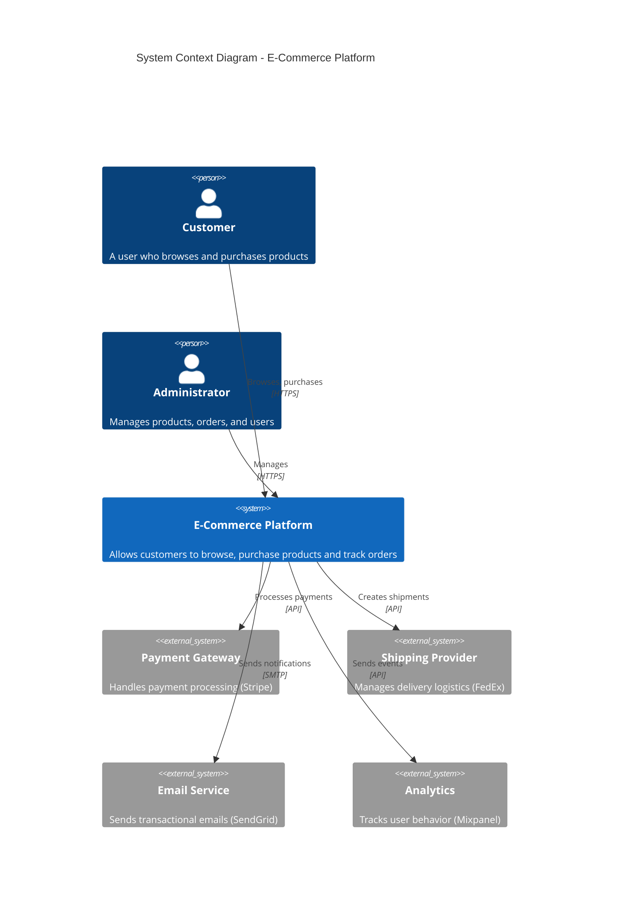

---

## 14. Architecture Diagram - Kubernetes Deployment

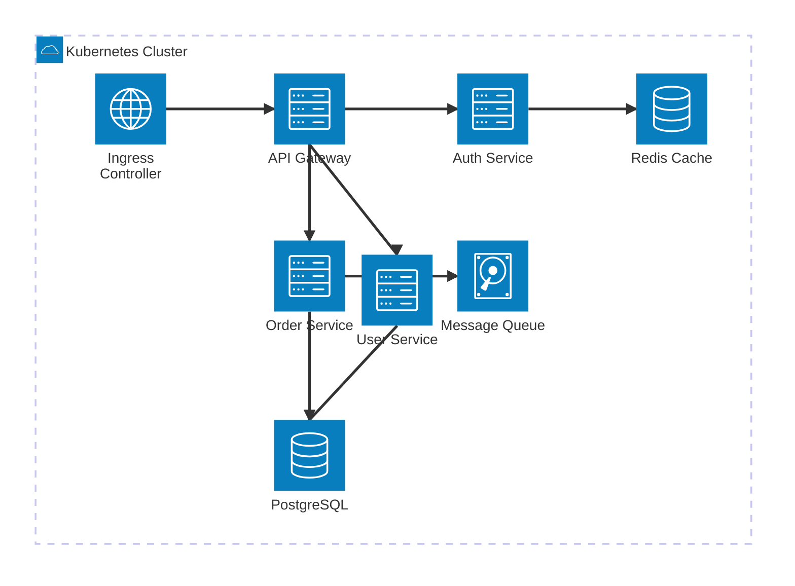

---

## Tips for Best Screenshots

1. **Use a light IDE theme** for better contrast
2. **Zoom to 100-150%** for crisp text
3. **Capture one diagram at a time** for clarity
4. **Include some surrounding context** (file tabs, gutter) to show IDE integration
5. **Use diagrams that showcase color** (flowcharts, class diagrams with styles)
